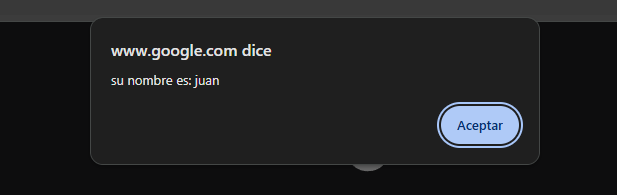
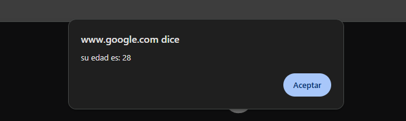
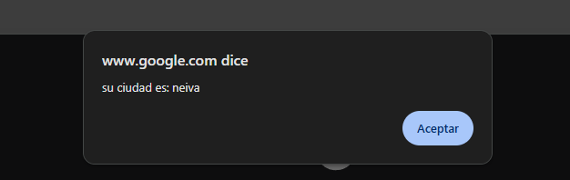

# Obtener parámetros de la URL

- Copia la siguiente url y pegala en un navegador `https://www.google.com/?nombre=juan&edad=28`

    > [!NOTE]
        En la URL reemplace los valores `juan` y `28` por su nombre y su edad.

- Abra la consola del navegador como se explicó en clase:
  
  - Si está en Windows Utilice la tecla `F12` o haga clic derecho (sobre el navegador) y presione la opción de **Inspeccionar**
  - Si está en Mac utilice la combinación de teclas `Opción + Comando + J`

- Copie y pegue el siguiente bloque de código en la consola del navegador:

<pre>const queryString = window.location.search;
const params = new URLSearchParams(queryString);
params.forEach((value, key) => alert(`su ${key} es: ${value}`)); 
</pre>

- Si realizó el proceso de manera correcta deberá aparecerle una alerta como la siguiente 

- despues de presionar en aceptar deberá salirle otra alerta

> [!TIP]
    Intente añadir nuevos parámetros a la URL, tenga en cuenta que el separador es el `&`. por ejemplo, si quiere añadir la ciudad, la URL debería quedar así `https://www.google.com/?nombre=juan&edad=28&ciudad=neiva`

> [!NOTE]
    Tenga en cuenta que al modificar la URL y presionar ENTER, la página recarga y por lo tanto la consola también inicia desde cero. Es decir, que al cambiar la URL deberá volver a copiar y pegar el bloque de código. Esta vez, debería aparecer una tercer alerta como la siguiente 

    
